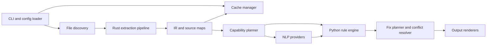
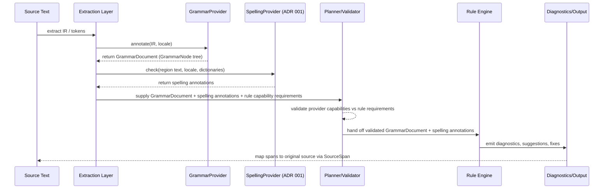

# Stilyagi design

- Status: Draft
- Updated: 2026-04-19
- Audience: Maintainers and reviewers implementing Stilyagi as a wholesale
  replacement for the current Vale-oriented repository.
- Companion documents:
  - [RFC 0001: Stilyagi Intermediate Representation](rfcs/0001-stilyagi-intermediate-representation.md)
  - [RFC 0002: Stilyagi Python rule API](rfcs/0002-stilyagi-python-rule-api.md)
  - [RFC 0003: Stilyagi CLI contract](rfcs/0003-stilyagi-cli-contract.md)
  - [RFC 0004: Stilyagi rule testing framework](rfcs/0004-stilyagi-rule-testing-framework.md)
  - [RFC 0005: Grammar capability and syntactic API extensions](
    rfcs/0005-grammar-capability-and-syntactic-api-extensions.md)
  - [ADR 001: Select a spell checking provider](
    adr-001-spell-checking-provider.md)
  - [ADR 002: Ratify the packaging boundary](
    adr-002-packaging-boundary.md)
  - [Documentation style guide](documentation-style-guide.md)
- Precedence: This design is normative for the v1 architecture. The existing
  RFC drafts remain useful inputs, but where they disagree with this document,
  this document wins.

## 1. Executive Summary

Stilyagi is a prose, documentation, comment, and docstring linter with a Rust
extraction layer and a Python rule engine. It is not a Vale wrapper, not a
general-purpose grammar checker, not an LLM writing assistant, and not a
sandbox for untrusted plugins. It is a programmable static-analysis tool for
human-facing text embedded in source repositories.

The product is aimed at teams that want structural awareness, source-faithful
diagnostics, and rules that are expressive enough to encode real editorial or
documentation policy. The recommended architecture is a Python-distributed
application with a Rust extension built via PyO3 and `maturin`. Rust owns file
discovery, Markdown parsing, host-language comment and docstring extraction,
source maps, and IR construction. Python owns configuration resolution,
capability planning, spaCy-backed enrichment, rule execution, diagnostics,
fixes, and plugin loading.[^1][^2][^3][^4][^5][^6][^7][^8]

The key design decision is to separate extraction from analysis. Rules must not
parse Markdown, walk tree-sitter nodes, or boot spaCy independently. They must
receive a stable region-oriented model plus selectively materialized linguistic
annotations. That gives Stilyagi Vale's structural awareness without Vale's
YAML rule ceiling, and it keeps the tool deterministic enough for continuous
integration (CI), editors, and agentic workflows.[^9]

## 2. Why - vision and purpose

### Problem and audience

Stilyagi solves the gap between simplistic prose linters and real
documentation-analysis needs.

Existing tools fall into four weak camps.

- Vale-like systems understand structure, but their rule model is constrained
  by declarative YAML, canned check families, and a deliberately limited
  extension surface.[^9]
- Ad hoc regular-expression (regex) linting is cheap to write, but it has poor
  structural awareness, poor fix safety, and poor false-positive behaviour once
  text lives inside headings, tables, docstrings, or mixed markup.
- Formatter-adjacent tools catch layout and some syntax-adjacent issues, but
  they are not designed to express editorial policy, terminology rules, or
  documentation structure constraints.
- Broad natural language processing (NLP) toolkits are flexible, but they do
  not provide source-faithful spans, repository-friendly CLI ergonomics,
  suppression semantics, or stable lint diagnostics out of the box.

The target users are engineers and technically literate writers maintaining
documentation inside source repositories. Their pain is not "English is hard".
Their pain is "documentation policy is real, files are structured, CI needs
determinism, and the current linting surface is either too dumb or too awkward
to encode the intended policy".

### Application responsibilities

Stilyagi performs six distinct jobs.

1. It discovers files and resolves effective configuration.
2. It parses source files and extracts lintable prose regions with exact source
   maps.
3. It builds a stable intermediate representation (IR) for those regions and
   their structural context.
4. It plans the minimum linguistic enrichment required by the selected rules.
5. It executes Python-authored rules against typed runtime objects.
6. It emits diagnostics, optional fixes, and machine-readable output.

The boundary is strict. Parsing and extraction happen before analysis. Rule
execution never mutates parse trees. Fix application never edits synthetic
spans. Output renderers never invent diagnostics of their own.

### Who will use it?

Table: primary user personas and their main concerns.

| Persona                                                           | What they care about                                                                                                   | What they will ignore                            |
| ----------------------------------------------------------------- | ---------------------------------------------------------------------------------------------------------------------- | ------------------------------------------------ |
| Documentation and tooling engineers                               | Deterministic CI, rule packs, Static Analysis Results Interchange Format (SARIF), stable spans, repository-wide policy | Fancy linguistic research features that slow CI  |
| Teams maintaining API docs and SDK docs                           | Markdown structure, terminology, heading policy, code-adjacent prose, per-file ignores                                 | Academic NLP purity                              |
| Python and Rust developers who care about docstrings and comments | Docstring summary rules, comment extraction, source-owner metadata, safe fixes                                         | Deep support for every markup dialect on day one |
| Technically opinionated solo developers                           | Fast CLI, expressive Python rules, debug visibility, local configuration                                               | Enterprise plugin governance                     |
| Agentic coding environments and CI systems                        | JSON output, stdin support, exit-code discipline, predictable cache and suppression behaviour                          | Interactive UI affordances                       |

The first group needs robust automation. The second needs documentation-aware
policy. The third needs comment and docstring extraction that does not lie
about source positions. The fourth needs programmable power without learning a
bespoke rule DSL. The fifth needs an honest machine interface.

### Why will they use it instead of alternatives?

Stilyagi's value proposition is precise.

- Compared with Vale, it offers Python-authored rules over a typed runtime
  model instead of YAML plus regex plus fixed rule families.[^9]
- Compared with regex-heavy in-house scripts, it provides structural parsing,
  stable spans, fix planning, suppression semantics, and cacheable behaviour.
- Compared with formatter-adjacent tools, it targets prose policy rather than
  code layout.
- Compared with raw spaCy or NLTK scripts, it adds extraction, diagnostics,
  fixes, rule selection, configuration, and CLI contracts that fit normal
  software engineering workflows.[^4][^5]

The Rust plus Python split is compelling because the two sides are doing
different work. Rust is excellent at parsing, offset accounting, and
cross-platform packaged performance. Python is excellent for rule authoring,
third-party extensibility, and reusing spaCy's annotation
ecosystem.[^1][^2][^3][^4][^5][^11][^12]

This design is weaker than some alternatives in three places.

- It will never match a Rust-only rule engine for raw execution speed.
- It deliberately trusts plugin code, so it cannot truthfully promise
  sandboxing.
- It inherits Python packaging complexity for third-party rule packs.

Those are acceptable costs. The product wins or loses on expressiveness,
debuggability, and adoption, not on shaving the last few milliseconds off a
single regex rule.

## 3. What - core requirements

### Core requirements

The system must satisfy the following v1 requirements.

- System must parse Markdown into a structure that preserves mdast-compatible
  concepts, positions, and extension choices.[^1][^2]
- System must extract docstrings and documentation comments from supported host
  languages using tree-sitter or language-specific extractors built on the same
  source-fidelity rules.[^3]
- System must preserve source-faithful byte spans and line or column mappings
  for every reported diagnostic and every applied edit.
- System must carry a line index or equivalent byte-to-line mapping in the IR
  so byte spans can be converted without reparsing source text.
- System must analyse prose as regions, not as undifferentiated file text.
- Users must be able to author rules in Python against typed runtime objects.
- Rules must declare required capabilities so the engine can avoid loading
  unnecessary NLP components.
- System must expose provider-neutral `SentenceNode` and `TokenNode` wrappers
  before grammar-aware rules touch backend objects directly.
- System must normalize canonical POS and dependency enums while preserving raw
  provider labels for debugging.
- Higher-order noun phrase, clause, and coordination helpers must remain
  analysis-layer abstractions rather than extractor-owned base IR facts.
- System must support diagnostics with optional fixes and explicit fix
  applicability classified as `safe`, `unsafe`, or `manual`.
- Users must be able to discover configuration from `pyproject.toml`,
  `stilyagi.toml`, or `.stilyagi.toml`, with explicit override behaviour.
- Users must be able to select or ignore rules by full code and by stable
  prefix.
- System must support file-level and range-level suppression directives in
  syntax-native comments, with comment syntax chosen per host language.
- System must support machine-readable output in JSON and Static Analysis
  Results Interchange Format (SARIF).
- System must preserve region `segments` mappings, including synthetic
  insertions such as soft-break spaces, so fixes cannot target text that did
  not originate in source bytes.
- System must cache extraction and analysis work using versioned cache keys
  that include source content hash, effective config hash, extractor version,
  enabled rule-pack versions, and NLP model signature where relevant.
- System must discover enabled third-party rule packs and capability providers
  via Python entry points.
- System must run without network access once installed.
- System must degrade gracefully on malformed input where the underlying parser
  can recover.

The system must not require a spaCy model for basic value. Structural and
lightweight text rules must work with the Rust extractor plus Python runtime
only. NLP-backed rules are an enhancement layer, not the price of entry.

### What actions need to happen?

The major workflows are:

- Lint a Markdown file by parsing it, extracting regions, selecting rules,
  planning capabilities, running rules, and rendering diagnostics.
- Lint Python docstrings by extracting enclosing module, class, and function
  docstrings plus owner metadata, then running docstring-focused rules.
- Run a subset of rules via prefix or explicit codes without paying for
  unrelated NLP capabilities.
- Apply safe fixes by planning edits against source-backed spans, resolving
  conflicts, and rewriting files or printing a diff.
- Dump IR for debugging so a maintainer can inspect extracted regions and span
  mapping when a false positive appears.
- Load third-party rule packs through entry points, validate their metadata,
  and integrate them into rule discovery without auto-enabling them.
- Run in CI with deterministic exit codes and machine-readable output.
- Run later in editors or agent-driven environments via the same extraction and
  analysis core, initially through CLI invocation and later through a daemon or
  Language Server Protocol (LSP) surface.

### What should the outcomes be?

The visible outcomes must be:

- Correct diagnostics tied to original source locations.
- Predictable latency for normal repository linting.
- Deterministic rule execution order and fix application.
- Explainable behaviour through `rule`, `config`, and `dump-ir`.
- Maintainable extension surfaces for rules and, later, extractors.
- False-positive investigation that does not require guesswork.
- Safe fixes that stay narrow and conservative by default.

The system-level outcomes must be:

- A stable, versioned IR contract.
- A stable Python rule API that is narrower than spaCy but expressive enough
  for real policies.
- Separation between extraction cache invalidation and rule-analysis cache
  invalidation.
- A repository layout and packaging strategy that supports Linux, macOS, and
  Windows wheel builds.

## 4. How - planning and implementation

### What are the required stack components?

The recommended stack is:

- Rust 2024 crates for parsing, extraction, source maps, IR construction, and
  cache serialization.
- `markdown-rs` for Markdown parsing and mdast-compatible AST
  generation.[^1][^2]
- tree-sitter for host-language parsing, error-tolerant extraction, and
  comment or docstring discovery.[^3]
- PyO3 for the Rust to Python extension boundary, packaged with
  `maturin`.[^11][^12]
- Python 3.14+ runtime for CLI, config, rule execution, and plugin loading.
- spaCy as the default NLP provider behind a capability interface, not as the
  public API itself.[^4][^5]
- A pure-Rust spell checking provider behind the same internal capability
  boundary, with ADR 001 currently proposing `spellbook` and keeping `zspell`
  as the fallback backend.
- Python entry points for rule-pack discovery.[^10]
- A Ruff-inspired CLI contract and configuration model.[^6][^7]

The boundaries matter.

- Rust must own parsing because byte accounting and multi-format extraction are
  correctness-critical and performance-sensitive.
- Python must own rules because rule authoring is the product's extension
  story.
- spaCy must sit behind a capability provider interface so Stilyagi can remain
  useful without hard-coding every public abstraction to one NLP library.

The rejected alternatives are:

- Pure Python parsing and extraction. Rejected because source-fidelity and
  future editor performance become harder immediately.
- A standalone Rust executable that embeds Python. Rejected for v1 because it
  makes plugin discovery, virtual-environment alignment, and Python packaging
  materially harder.
- Direct JSON-only hand-off between Rust and Python for every file. Rejected as
  the mandatory hot-path boundary because serializing and reparsing full IR on
  every run wastes time and memory. JSON should be the canonical debug and test
  representation, not the only in-process transport.
- LangChain or LLM-driven analysis in the core engine. Rejected because it
  destroys determinism, offline operation, and trust.

### What are the system requirements?

The v1 technical requirements are:

- Single-file structural linting should feel interactive. Target less than
  200 ms cold and less than 75 ms warm for a typical Markdown file on a modern
  laptop.
- Single-file NLP-backed linting with an already installed English model should
  stay under roughly 500 ms cold and 150 ms warm for ordinary documentation
  pages.
- Warm repository-scale runs with structural rules should complete in seconds,
  not minutes, on normal documentation repositories.
- Memory use must scale with batches of regions, not with whole-repository
  concatenation into one giant NLP document.
- Rule execution must be deterministic by default. Sort rules by pack name then
  code, and sort files by normalized path before execution.
- Capability planning must honour provider dependency chains. For example,
  lemmatization may require POS tagging, and dependency parsing implies
  sentence segmentation.
- Safe fixes must preserve syntax and target only source-backed spans.
- Malformed Markdown, docstrings, or comments must produce partial extraction
  plus recoverable errors where possible, rather than aborting the whole run.
- Plugin loading must treat third-party packs as trusted code and make that
  explicit in docs and CLI help.
- Configuration precedence must be inspectable and reproducible.
- Logging and debugging must expose cache hits, provider selection, and
  extraction anomalies in verbose mode.
- The product must remain portable across Linux, macOS, and Windows.
- The core product must remain CI-friendly and offline after installation.

The v1 non-requirements are also important.

- V1 does not need editor daemon mode.
- V1 does not need cross-file semantic inference.
- V1 does not need full MDX (Markdown with embedded JSX) support as a stable
  promise, though the parser can be designed so MDX lands later.
- V1 does not need multiprocessing NLP. spaCy's own documentation warns that
  process spawning on macOS and Windows can be expensive, so batching with
  `nlp.pipe` in one process is the default plan.[^4]

### What are the key user flows?

#### First run on a docs repository

- Entry point: `stilyagi check .`
- Steps: resolve config, discover files, build extraction plan, warm caches,
  run structural rules, render diagnostics.
- Branching: if required NLP models are missing, only rules that depend on them
  fail resolution; structural rules still run unless the selected rule set
  explicitly requires the missing provider.
- Success criteria: deterministic diagnostics with clear file and span output.
- Failure path: invalid config, plugin conflict, or provider resolution error
  exits with status `2` and actionable messaging.

#### Authoring a custom Python rule

- Entry point: install or edit a rule-pack package exposing entry points.
- Steps: subclass `Rule`, declare metadata and capabilities, write tests, list
  the pack in config, inspect `stilyagi rules`.
- Branching: if config for the rule is invalid, Stilyagi rejects the run before
  processing files.
- Success criteria: the rule appears in discovery output and can emit stable
  diagnostics.
- Failure path: duplicate codes or broken entry points fail plugin loading.

#### Investigating a false positive

- Entry point: `stilyagi dump-ir path/to/file` and `stilyagi rule CODE`
- Steps: inspect regions, origin nodes, suppression state, and the rule's
  explanation; rerun with `--verbose` if needed.
- Branching: if the region text is correct but the rule logic is wrong, fix the
  rule; if the region text is wrong, fix the extractor.
- Success criteria: the maintainer can identify whether extraction, capability
  planning, or rule logic caused the issue.
- Failure path: if `dump-ir` cannot serialize due to internal bugs, that is an
  engine defect and must fail loudly.

#### Applying safe fixes in CI or pre-commit

- Entry point: `stilyagi check --fix` locally, or `stilyagi check --diff` in
  CI.
- Steps: run rules, collect fixable diagnostics, filter to safe fixes, resolve
  edit conflicts, apply edits or emit a patch.
- Branching: unsafe fixes require explicit opt-in.
- Success criteria: clean patch application with no overlapping edits on
  synthetic spans.
- Failure path: conflict or invalid edit yields diagnostics without mutation.

#### Integrating a third-party rule pack

- Entry point: install the package and list it in config.
- Steps: plugin loader reads entry points, validates metadata, resolves code
  conflicts, and activates the pack.
- Branching: installed but unconfigured packs remain inert.
- Success criteria: only named packs run, and their rules participate in
  selection and help output.
- Failure path: duplicate rule codes, invalid metadata, or import-time errors
  fail startup with explicit pack names.

#### Debugging extraction with IR output

- Entry point: `stilyagi dump-ir file.md --output-format json`
- Steps: emit canonical JSON describing source metadata, regions, owners,
  segments, suppressions, and extraction errors.
- Branching: debug output may include preview-only internal fields in verbose
  mode, but the stable schema must stay versioned.
- Success criteria: a maintainer can diff IR across commits and write golden
  tests from it.
- Failure path: schema-version mismatch or malformed debug output is a release
  blocker.

### What are the core interfaces?

#### CLI

User-facing contract:

```plaintext
stilyagi check [FILES]...
stilyagi rule CODE
stilyagi rules
stilyagi config [KEY]
stilyagi clean
stilyagi dump-ir [FILES]...
```

Implementation consequences:

- The CLI stays small and memorable.
- `check` is the only mutating command.
- `dump-ir` is mandatory because the architecture depends on extracted regions.
- The existing `install`, `zip`, and `update-tengo-map` surfaces are removed as
  part of the replacement, not preserved behind compatibility aliases.
- `--no-cache` belongs in v1 because cache debugging is part of real operation.
- `server`, `doctor`, and `migrate-config` remain reserved names, not shipping
  commands.

#### Config file schema

User-facing contract:

```toml
[tool.stilyagi]
cache-dir = ".stilyagi_cache"
respect-gitignore = true
locale = "en"
plugins = ["builtin"]

[tool.stilyagi.lint]
select = ["MD", "DOC", "PUN", "STY", "PYDOC", "RSDOC"]
ignore = []
preview = false

[tool.stilyagi.discovery]
include = ["**/*.md", "**/*.py", "**/*.rs"]

[tool.stilyagi.extract.markdown]
gfm = true
frontmatter = true
mdx = false

[tool.stilyagi.nlp]
provider = "spacy"
profile = "en-basic"

[tool.stilyagi.rule.PUN201]
min_items = 3
```

Implementation consequences:

- Use nearest-config semantics with explicit `extend`, modelled on Ruff.[^6]
- Do not auto-load user-level configuration in v1.
- Separate `locale` from `syntax` and from `nlp.profile`. The current RFC
  overloads `language`.

#### IR schema

User-facing contract:

```json
{
  "version": 1,
  "source": {
    "path": "docs/guide.md",
    "syntax": "markdown",
    "encoding": "utf-8",
    "content_hash": "sha256:..."
  },
  "line_index": [0, 24, 51],
  "regions": [
    {
      "id": "r42",
      "kind": "paragraph",
      "syntax": "markdown",
      "natural_language": "en",
      "text": "Use explicit trade-offs.",
      "segments": [
        { "text_start": 0, "text_end": 24, "source": { "start": 128, "end": 152 } },
        { "text_start": 24, "text_end": 25, "source": null, "synthetic": "soft_break_space" }
      ],
      "owner": { "kind": "section", "heading_depth": 2, "heading_text": "Principles" }
    }
  ]
}
```

Implementation consequences:

- Define the IR as a logical schema first.
- Provide canonical JSON for `dump-ir`, schema tests, and golden fixtures.
- Do not force JSON as the only internal transport between Rust and Python.
- Make `line_index`, `content_hash`, and `segments` first-class schema
  features rather than optional convenience fields.

#### Python rule API

User-facing contract:

```python
class HeadingDepthRule(Rule):
    code = "DOC203"
    name = "heading-depth-jump"
    summary = "Reject heading depth jumps."
    targets = [RegionTarget(kind={"heading"})]
    requires = {Capability.STRUCTURE}

    def visit_region(self, ctx: RuleContext, region: Region):
        ...
```

Implementation consequences:

- Provide typed wrappers, not raw dictionaries.
- Hide spaCy internals behind stable token and sentence objects.
- Keep astroid inspiration at the ergonomic level, not the semantic-inference
  level.[^8]

#### Plugin entry points

User-facing contract:

- `stilyagi.rules`
- `stilyagi.capabilities`

Implementation consequences:

- Resolve entry points via `importlib.metadata`.
- Reject duplicate rule codes or duplicate pack names at startup.
- Do not auto-activate third-party packs just because they are installed.[^10]

#### Diagnostics output

User-facing contract:

- `text` for humans
- `json` for tools
- `sarif` for CI integrations

Implementation consequences:

- All renderers derive from one internal diagnostic model.
- JSON output includes fix applicability.
- SARIF mapping is an output adapter, not a second diagnostic engine.

#### Fix and edit model

User-facing contract:

```json
{
  "code": "PUN201",
  "message": "Use a serial comma before the final conjunction.",
  "fix": {
    "title": "Insert serial comma",
    "applicability": "safe",
    "edits": [
      { "byte_start": 341, "byte_end": 341, "replacement": "," }
    ]
  }
}
```

Implementation consequences:

- Edits target original bytes only.
- `manual` means "fixable in principle, but not as an automatic edit in v1".
- Safe, unsafe, and manual fixes stay separate.
- Overlapping edits from different diagnostics fail conflict resolution unless
  identical.

#### Suppression syntax

User-facing contract:

```md
<!-- stilyagi: ignore-next PUN201 -->
Apples, bananas and pears.
```

```python
# stilyagi: disable PYDOC210
def f():
    """Returns the value."""
# stilyagi: enable PYDOC210
```

Implementation consequences:

- Suppression parsing belongs in extraction.
- Markdown uses HTML comments; Python uses `#`; Rust and JavaScript use `//`.
- Suppression state must be visible in IR and debug output.
- Blanket inline suppression remains forbidden in v1.

## 5. Business requirements

### What business rules must be followed?

These rules are non-negotiable.

- Source spans must remain faithful to original bytes.
- IR line indexes and segment maps must remain faithful to original bytes.
- Fixes must never target synthetic spans.
- Safe, unsafe, and manual fix states must remain distinct.
- Third-party plugins are trusted code and must not be marketed as sandboxed.
- Rule execution must be deterministic by default.
- Configuration precedence must be legible and inspectable.
- User-level configuration must not be auto-loaded in v1.
- Core functionality must not require network access.
- Built-in rules and providers must never auto-download NLP models.
- Malformed source must degrade gracefully where practical.
- Installed third-party rule packs must not auto-run unless activated.
- JSON and SARIF output must be derived from the same diagnostic facts.
- The replacement must not preserve the current Vale-packaging CLI out of
  nostalgia or sunk-cost bias.

### Implementation priorities

High priority:

- Markdown extraction with source maps.
- Python-authored structural and lightweight text rules.
- Stable diagnostics and safe-fix machinery.
- Config discovery, rule selection, suppressions, JSON output, and cache.
- Python and Rust docstring or doc comment extraction.

Medium priority:

- RFC 0005's grammar-node layer: `TokenNode` and `SentenceNode` first, then
  higher-order clause and coordination helpers.
- spaCy-backed sentence, lemma, part-of-speech, and dependency capabilities.
- Built-in dictionary-based spelling support behind a Stilyagi-owned provider
  facade, following ADR 001's `spellbook`-first plan and `zspell` fallback.
- Third-party rule packs and capability plugins.
- SARIF output.
- MDX and additional host-language support after extractor tests exist.

Lower priority:

- Extractor plugins for arbitrary structured sources.
- Daemon or LSP server mode.
- Cross-file terminology or acronym inference.
- Vector-backed semantic similarity rules.
- Any LLM-assisted analysis or rewriting layer.

This ordering is based on time to value and dependency structure. Structural
linting and source-fidelity are the foundation. Without them, higher-order NLP
is irrelevant.

### Paths to customer value

Table: vertical delivery slices and the user value each one unlocks.

| Slice   | User problem solved                                           | Layers touched                                                             | Major interfaces                    | Measurable value                                                        | Deliberately left out    |
| ------- | ------------------------------------------------------------- | -------------------------------------------------------------------------- | ----------------------------------- | ----------------------------------------------------------------------- | ------------------------ |
| Slice 1 | "Lint my Markdown docs with real spans and safe fixes."       | Rust Markdown extractor, Python CLI, built-in rules, renderer              | `check`, config, JSON diagnostics   | Useful on day one for documentation repositories                        | Docstrings, plugins, NLP |
| Slice 2 | "Lint my Python and Rust docstrings and doc comments."        | tree-sitter extraction, owner metadata, doc rules                          | IR, `check`, `dump-ir`              | Brings prose linting into source trees                                  | Complex linguistic rules |
| Slice 3 | "Run smarter sentence and syntax-aware prose rules."          | capability planner, spaCy provider, grammar-node wrappers, richer rule API | rule API, grammar nodes, NLP config | Enables real editorial policy such as passive voice or list punctuation | Cross-file semantics     |
| Slice 4 | "Adopt this in CI and extend it with project-specific packs." | entry-point plugins, SARIF, rule docs                                      | `rules`, `rule`, SARIF              | Team adoption and ecosystem value                                       | Daemon mode              |

The path is intentionally vertical. Every slice leaves behind a usable product.

## 6. Architecture Recommendation

Figure 1: Stilyagi v1 runtime architecture and data flow.



Figure 2: Capability-planned enrichment flow from source text through
extraction, grammar and spelling providers, rule execution, and source-mapped
diagnostics. The diagram shows the ADR 001 spelling-provider path alongside the
grammar-provider path, with both feeding validated analysis results back into
the same rule-engine and diagnostics pipeline.



The recommended subsystems are:

- Rust extraction pipeline: file reading, Markdown parsing, tree-sitter
  parsing, region extraction, owner metadata, suppression parsing, source maps,
  and extraction errors.
- IR generation: logical schema plus canonical JSON serializer, `line_index`
  construction, content hashes, and segment-map invariants.
- Python analysis engine: wraps IR into `Document`, `Region`, and the
  provider-neutral grammar objects used by rules, including `SentenceNode`,
  `TokenNode`, and later clause or coordination helpers.
- Capability planner: computes the minimum provider plan from selected rules,
  locales, and region targets.
- Rule execution engine: schedules rules, batches regions, and collects
  diagnostics.
- Fix planner and conflict resolver: validates edits, filters by applicability,
  and applies or prints patches.
- Config loader: resolves nearest config, `extend` chains, and CLI overrides.
- Plugin loader: loads rule packs and provider plugins via the
  `stilyagi.rules` and `stilyagi.capabilities` entry points, validates
  metadata, and keeps installed but unconfigured packs inert.
- Cache manager: maintains separate extraction and analysis caches.
- Output renderers: text, JSON, and SARIF.

These are the right boundaries because they align with failure modes.

- Extraction bugs live in Rust and can be debugged with `dump-ir`.
- Rule bugs live in Python and can be debugged without re-parsing.
- NLP provider changes do not force IR redesign.
- Output format work does not mutate diagnostics or fixes.

## 7. Data and Contract Design

### 7.1 Intermediate representation

Strong points in RFC 0001:

- The insistence on byte-faithful spans is correct.
- The `segments` model is the right answer for flattened prose with markup
  elision.
- Separating nodes from regions is conceptually sound.
- Canonical JSON for debug and compatibility is useful.

Weaknesses and ambiguities:

- The RFC conflates the logical contract with the in-process transport.
- `language` and `host_language` are ambiguous. One means syntax, the other
  appears to mean natural language.
- `summary_line` does not belong in the extractor-level region vocabulary. It
  is a derived view over a docstring or paragraph.
- A public full-node API for tree-sitter-backed source files is over-scoped for
  v1 and risks turning Stilyagi into a generic code query tool.

Recommended revisions:

- Rename source syntax to `syntax`.
- Add optional `natural_language`.
- Add explicit `owner` metadata to regions for docstrings and comments.
- Add required `line_index` and make `segments` capable of representing
  synthetic insertions explicitly.
- Keep full structural trees internal or debug-only for non-Markdown sources in
  v1; expose only what rules need.
- Treat JSON as the canonical serialization, not the mandatory hot-path
  transport.

Compatibility risks:

- If v1 exposes raw tree-sitter nodes publicly, future grammar upgrades will
  create API churn.
- If `summary_line` is persisted as a first-class region, rules will start to
  rely on a derived artefact that should stay engine-owned.

V1 sufficiency:

- The current RFC is close, but not sufficient until the transport versus
  schema distinction and the `language` naming problem are fixed.

### 7.2 Python rule API

Strong points in RFC 0002:

- Capabilities are the right planning primitive.
- Typed wrappers are preferable to raw dictionaries.
- Entry-point-based plugin discovery is correct.
- The trust model is honest.

Weaknesses and ambiguities:

- `NodeTarget` is too broad for v1.
- The astroid analogy is useful, but `infer()`-style semantics are not needed
  and would invite over-design.
- `visit_token` for every token in every selected region can become expensive if
  target filtering is not compiled carefully.
- The current draft lacks a strong story for locale-aware policy versus syntax
  language.

Recommended revisions:

- Make `RegionTarget` the primary target for v1.
- Keep `NodeRef` available, but narrow public guarantees for non-Markdown
  nodes.
- Add `owner` and `locale` convenience APIs so docstring rules do not have to
  reverse-engineer enclosing code structure.
- Specify deterministic rule order and conflict handling explicitly.
- Reserve provider-specific backend escape hatches for unstable APIs only.

Compatibility risks:

- Exposing too much raw spaCy or tree-sitter surface will freeze backend
  details prematurely.
- Allowing plugin packs to register arbitrary hook shapes will make engine
  scheduling harder to stabilize.

V1 sufficiency:

- The current rule API is directionally good, but it needs narrowing and
  stronger performance semantics before implementation.

#### Grammar-capability extension

Strong points in RFC 0005:

- It keeps grammar support behind explicit capabilities rather than making NLP
  state globally available.
- It uses provider-neutral grammar wrappers instead of freezing the public API
  to spaCy classes.
- It distinguishes sentence and token foundations from higher-order
  noun-phrase, clause, and coordination helpers.
- It keeps advisory grammar diagnostics and fix safety tied to source-backed
  spans.

Recommended revisions:

- Treat `TokenNode`, `SentenceNode`, `UPos`, `Dep`, and `MorphFeatures` as the
  first compatibility wave for grammar-aware rules.
- Add `NounPhraseNode`, `ClauseNode`, `CoordinationNode`, token patterns, and
  dependency patterns only after the lower-level wrappers are stable.
- Keep grammar nodes as analysis-layer objects derived from IR plus provider
  annotations rather than as mandatory extractor-level JSON fields.
- Reserve backend escape hatches such as `token.backend("spacy")` for unstable
  APIs only.
- Require `dump-ir --include-grammar` or an equivalent debug surface once the
  grammar layer exists so maintainers can inspect derived syntax state without
  reverse-engineering provider internals.

Compatibility risks:

- If the public API exposes raw spaCy labels or classes too early, Stilyagi
  will inherit backend churn directly.
- If higher-order clause and coordination nodes are treated as guaranteed facts
  rather than advisory analysis views, rules will overclaim certainty.

V1 sufficiency:

- RFC 0005 is a good fit for the architecture, but it should land in phases:
  first `TokenNode` and `SentenceNode` plus core dependency access, then the
  higher-order convenience nodes and richer rule helpers.

#### Spelling-capability extension

Strong points in ADR 001:

- It keeps built-in spelling support behind the same provider-neutral boundary
  as the rest of the rule engine.
- It selects a pure-Rust backend path that fits the PyO3 plus `maturin`
  packaging model.
- It treats spelling as a sibling capability to grammar analysis, not as a
  disguised Vale-compatibility layer.
- It keeps the first delivery wave focused on correctness checks, span
  fidelity, and personal-dictionary support rather than suggestion quality.

Recommended revisions:

- Add spelling-capability names and planner semantics to the Python rule API
  before implementation work starts, so grammar and spelling providers share
  one canonical planning vocabulary.
- Keep dictionary loading and offset mapping on the Rust side, close to the
  extraction and `segments` machinery.
- Treat `spellbook` as the first provider spike, but keep the fallback path to
  `zspell` explicit until the acceptance gates pass.
- Expose spelling diagnostics through the same diagnostic and fix-applicability
  model used by structural and grammar-aware rules.

Compatibility risks:

- If spelling exposes backend-owned types or raw dictionary handles publicly,
  Stilyagi will freeze the wrong surface too early.
- If spelling suggestions are treated as mandatory in the first wave, provider
  churn will dominate what should be a narrow correctness feature.

V1 sufficiency:

- ADR 001 gives the project a concrete provider direction, but the capability
  names, planner integration, and acceptance gates still need implementation
  work before built-in spelling support becomes part of the stable v1 surface.

### 7.3 CLI contract

Strong points in RFC 0003:

- The compact Ruff-like command surface is right.[^6][^7]
- Nearest-config plus explicit `extend` is right.[^6]
- Safe and unsafe fix separation is right.[^7]
- `dump-ir` is essential.

Weaknesses and ambiguities:

- The draft includes too many source-language file types for a v1 extractor
  story that has not yet earned them.
- It mirrors Ruff well, but it does not yet separate what is mandatory in v1
  from what is merely nice to have.
- `version` as a subcommand is acceptable, but global `-V` is the more
  important contract.

Recommended revisions:

- V1 discovery defaults should cover `*.md`, `*.py`, and `*.rs`, with `*.mdx`
  as preview-only until proven.
- Keep `check`, `rule`, `rules`, `config`, `clean`, and `dump-ir`.
- Add `--no-cache` in v1 because cache debugging is unavoidable.
- Keep `server`, `doctor`, and `migrate-config` reserved.

Compatibility risks:

- Over-claiming file-type support in v1 will create a support burden.
- Copying Ruff's user-level config fallback would make CI parity worse.

V1 sufficiency:

- The CLI contract is largely sufficient once scope is trimmed and cache
  controls are made explicit.

## 8. Risks, failure modes, and trade-offs

Table: principal technical risks, mitigations, and early validation checks.

| Risk                                         | Why it matters                                          | Severity | Mitigation                                                          | Early test                                                    |
| -------------------------------------------- | ------------------------------------------------------- | -------- | ------------------------------------------------------------------- | ------------------------------------------------------------- |
| Span mapping bugs                            | They destroy trust in diagnostics and fixes             | Critical | Golden tests for source maps and edit round-trips                   | Compare region spans and applied edits against fixtures       |
| Over-coupling to spaCy                       | It freezes the public API to one backend                | High     | Capability provider interface and stable wrapper objects            | Run rules against mocked providers and spaCy                  |
| Plugin API instability                       | Third-party rule packs will break across minor releases | High     | Narrow v1 API, semantic versioning, contract tests                  | Build sample external rule packs in CI                        |
| Performance collapse from indiscriminate NLP | Users will stop enabling smarter rules                  | High     | Capability planner, batching, no default parser for structural runs | Benchmarks for structural-only versus POS and dependency runs |
| Markdown flattening ambiguity                | Sentence and token spans can drift across inline markup | High     | `segments` mapping plus explicit synthetic spans                    | Fixtures with emphasis, links, inline code, and soft breaks   |
| Docstring extraction edge cases              | Wrong owners or missing docstrings will misfire rules   | Medium   | Per-language extractor tests with nested classes and decorators     | Golden fixtures for Python and Rust                           |
| Cross-platform packaging pain                | Python plus Rust projects fail if wheels are messy      | High     | Use `maturin`, CI wheel matrix, mixed source layout                 | Linux, macOS, and Windows wheel install smoke tests           |
| Config confusion                             | Hidden precedence creates hard-to-debug runs            | Medium   | `config` command, nearest-config semantics, no user-level config    | Snapshot tests for resolved config sources                    |
| False confidence around autofixes            | Unsafe rewrites can damage prose nuance                 | High     | Safe by default, narrow edit scope, no edits on synthetic spans     | Safety corpus with human-reviewed fixtures                    |

## 9. Alternatives Considered

### Pure Python implementation

Rejected. It simplifies packaging of the rule engine, but it makes structural
parsing, source maps, and future editor responsiveness worse at the exact point
where Stilyagi must be strongest.

### Rust-only rule engine

Rejected. It would improve raw speed and shrink runtime dependencies, but it
would cripple the rule authoring story. The whole point of Stilyagi is to let
engineers write real rules without living inside a bespoke DSL or recompiling
the linter.

### Vale-compatible wrapper

Rejected. The user requirement is a wholesale replacement, and the technical
case agrees. Carrying Vale packaging or config compatibility would preserve the
wrong constraints.

### Direct raw-AST rule authoring

Rejected for v1. It makes simple structural rules possible, but text-oriented
rules would repeatedly flatten markup and rebuild context. Regions are the
correct primary abstraction.

### Heavier LLM-assisted analysis layer

Rejected. It is nondeterministic, expensive, hard to test, and hostile to
offline CI use. It belongs outside the core linter.

### No IR, regions only

Rejected. Structural rules need context, and debug visibility matters.

### No tree-sitter, regex-based comment heuristics only

Rejected. It would be quicker to hack together, but it would collapse on real
source files, malformed syntax, and owner metadata extraction.

## 10. Recommended Repository and Package Layout

```plaintext
stilyagi/
├── Cargo.toml
├── pyproject.toml
├── python/
│   └── stilyagi/
│       ├── __init__.py
│       ├── cli.py
│       ├── config.py
│       ├── diagnostics.py
│       ├── engine/
│       │   ├── planner.py
│       │   ├── runner.py
│       │   ├── fixes.py
│       │   └── renderers.py
│       ├── model/
│       │   ├── document.py
│       │   ├── region.py
│       │   ├── sentence.py
│       │   └── token.py
│       ├── nlp/
│       │   ├── base.py
│       │   └── spacy_provider.py
│       ├── plugins.py
│       └── rules/
│           └── builtin/
├── crates/
│   ├── stilyagi-core/
│   ├── stilyagi-markdown/
│   ├── stilyagi-tree-sitter/
│   ├── stilyagi-extract/
│   ├── stilyagi-ir/
│   └── stilyagi-pyext/
├── tests/
│   ├── golden/
│   ├── integration/
│   ├── performance/
│   └── rulepacks/
└── docs/
    ├── contents.md
    ├── stilyagi-design.md
    └── rfcs/
```

Use `python/` as the Python source root to avoid the common mixed-project
import trap that `maturin` itself documents.[^12] The `stilyagi-pyext` crate is
the PyO3 bridge crate. Other Rust crates remain ordinary libraries and are
testable without Python.

## 11. Validation Plan

The design must be validated with the following test classes.

- Golden extraction tests: canonical IR JSON for Markdown, Python, and Rust
  fixtures, with Rust-side snapshot tests using `insta` where helpful.
- Malformed input tests: broken Markdown, partial MDX, invalid Python, and
  incomplete Rust comments.
- Performance baselines: cold and warm runs for structural-only and NLP-backed
  rule sets.
- Rule-pack integration tests: install synthetic third-party packs and verify
  discovery, activation, conflict errors, and config parsing.
- Autofix safety tests: ensure safe fixes never target synthetic spans and
  overlapping edits are rejected or merged deterministically.
- Cache correctness tests: change content, config, parser version, rule-pack
  version, and NLP profile independently and verify invalidation.
- Property tests: use `proptest` on Rust span or segment invariants and
  `hypothesis` on Python rule-engine invariants where that buys real coverage.
- Contract tests: CLI help snapshots, JSON schema validation, SARIF smoke
  tests, and rule metadata rendering.
- Compatibility tests: Linux, macOS, and Windows wheel builds and smoke
  installs, plus supported syntax corpus tests across Markdown, Python, and
  Rust.

## 12. Open questions and required ADRs

### Resolved before implementation

- Packaging boundary: resolved by
  [ADR 002](adr-002-packaging-boundary.md), which accepts the PyO3 plus
  `maturin` extension boundary and rejects helper-binary transport for normal
  v1 execution.
- V1 syntax scope, IR transport policy, and locale support policy: resolved by
  [ADR 003](adr-003-v1-contract-scope.md), which keeps Markdown, Python
  docstrings, and Rust documentation comments as the stable v1 syntax surfaces,
  keeps MDX preview-only, keeps JSON canonical for debug and compatibility
  without forcing it as the only in-process transport, and limits formal v1
  locale support to English.

### Can resolve during implementation

- Exact owner metadata shape for docstrings and comments. Recommendation:
  implementation spike plus RFC amendment.
- Spelling capability names, planner semantics, and acceptance gates after ADR
  001's provider selection. Recommendation: implementation spike plus RFC
  amendment.
- Exact dependency-label normalization table and the grammar debug-output
  schema. Recommendation: implementation spike plus RFC 0005 follow-up.
- Whether extractor plugins land in v1 or immediately after. Recommendation:
  implementation spike.
- Exact cache encoding for on-disk analysis artefacts. Recommendation:
  implementation spike.

### Can defer until after v1

- Daemon or LSP protocol and incremental update strategy. Recommendation: new
  RFC.
- Cross-file terminology and acronym inference. Recommendation: roadmap item.
- Vector-backed or semantic-similarity rules. Recommendation: roadmap item.
- Any LLM-backed suggestion surface. Recommendation: reject for core v1 and
  revisit only with a separate RFC.

## 13. Final Recommendation

Build this in the following order.

- Build first: a Python-distributed replacement product with a Rust extraction
  extension, ratified by [ADR 002](adr-002-packaging-boundary.md) and
  [ADR 003](adr-003-v1-contract-scope.md), Markdown extraction, Python and
  Rust docstring or doc comment extraction, a stable region-oriented IR,
  built-in structural rules, safe fixes, and a Ruff-like CLI.
- Add next: the RFC 0005 grammar layer in two waves, with `TokenNode` and
  `SentenceNode` plus selective POS or dependency capabilities first, then
  higher-order clause and coordination helpers after the low-level model has
  proven stable.
- Postpone: full semantic inference, MDX as a stable promise, support for
  locales beyond English, SARIF polish, extractor plugins, and daemon mode.
- Reject outright: Vale-compatibility baggage, LLM-assisted core analysis,
  auto-downloading models, and any claim that third-party plugins are sandboxed.
- First meaningful release: `stilyagi check`, `rule`, `rules`, `config`,
  `clean`, and `dump-ir`, with Markdown plus Python and Rust docstring or
  doc-comment support, stable JSON diagnostics, safe fixes, English-only formal
  locale support, a documented Python rule-pack story, and an implementation
  path for RFC 0005's provider-neutral grammar nodes.

The product should earn complexity, not assume it. A precise structural core
with a disciplined Python rule API will deliver customer value faster than a
grand architecture that tries to solve every prose problem at once.

## References

[^1]: [markdown-rs crate docs](https://docs.rs/markdown/latest/markdown/)
[^2]: [markdown-rs repository README](https://github.com/wooorm/markdown-rs)
[^3]: [Tree-sitter introduction](https://tree-sitter.github.io/tree-sitter/)
[^4]: [Tree-sitter advanced parsing](https://tree-sitter.github.io/tree-sitter/using-parsers/3-advanced-parsing.html)
[^5]: [Tree-sitter query syntax](https://tree-sitter.github.io/tree-sitter/using-parsers/queries/1-syntax.html)
[^6]: [Ruff configuration documentation](https://docs.astral.sh/ruff/configuration/)
[^7]: [Ruff linter documentation](https://docs.astral.sh/ruff/linter/)
[^8]: [Astroid inference introduction](https://pylint.readthedocs.io/projects/astroid/en/latest/inference.html)
[^9]: [Vale introduction](https://vale.sh/docs)
[^10]: [PyPA entry points specification](https://packaging.python.org/en/latest/specifications/entry-points/)
[^11]: [PyO3 user guide](https://pyo3.rs/)
[^12]: [Maturin user guide](https://www.maturin.rs/)
